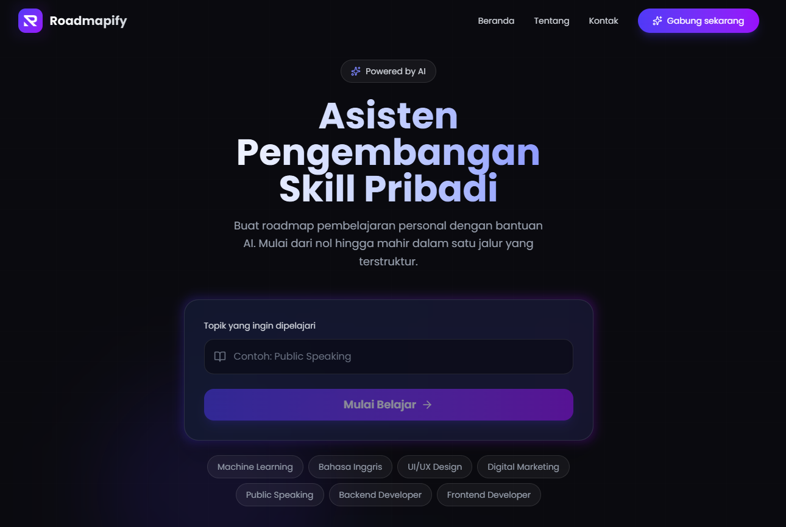
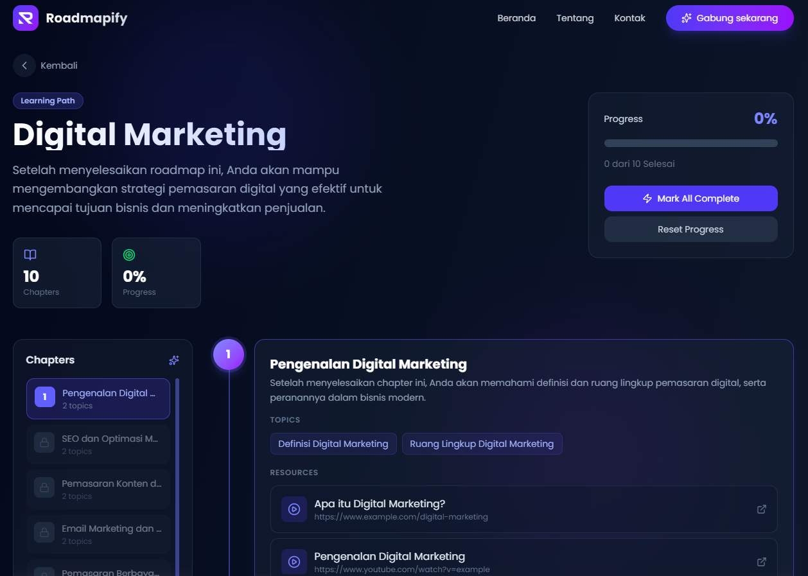

# 🔍 AI-Powered Learning Path Generator

Aplikasi berbasis AI yang menghasilkan learning path terstruktur dan dipersonalisasi berdasarkan tujuan karir, level skill, dan preferensi belajar pengguna. Dibangun menggunakan Vite, React TypeScript dan AI integration.


## 📸 Screenshot
### Homepage
<p align="center">
  
</p>


### Generate Learning Path


## ✨ Features

- **Personalized Learning Path**: Generate roadmap belajar sesuai goal pengguna  
- **AI Recommendation**: Rekomendasi materi dan langkah belajar berbasis AI  
- **Curated Resources**: Sumber belajar terpilih (artikel, video, course)  
- **Progress Tracking**: Monitor perkembangan belajar secara real-time  
- **Dynamic Roadmap**: Roadmap dapat disesuaikan seiring progress user  
- **Responsive UI**: Tampilan responsive di desktop dan mobile 

## 💻 Tech Stack
Roadmapify dibangun menggunakan teknologi modern untuk performa optimal dan pengalaman pengguna yang responsif:

- ⚡ Vite – Build tool super cepat untuk frontend modern
- ⚛️ React – Library UI untuk membangun interface interaktif
- 🎨 Tailwind CSS – Styling cepat dan fleksibel
- 🧠 AI Integration – Generate learning path secara dinamis
- 🗄️ MongoDB – Database untuk menyimpan data user, hasil generate user & progress

## 🚀 Quick Start

```bash
# Clone repository
git clone https://github.com/username/roadmapify.git
cd roadmapify

# Copy 
cp .env.example .env

# Install Dependencies
npm install

# Running Project 
npm run dev

# Akses di http://localhost:5173